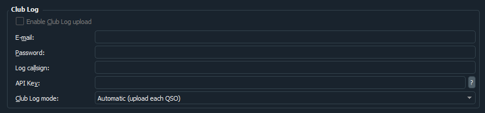

# Changelog

All notable changes to WKjTX are documented in this file.

The format is based on Keep a Changelog. This project follows
semantic versioning adjusted for a fork: the `2.2.x` in the
upstream JTDX version is preserved in internal Versions.cmake
for code compatibility, but public releases are tagged
`v0.1.0` → `v1.0.0` reflecting WKjTX's own delivery phases.

## [Unreleased] — v1.4.0 — Update check · Club Log

### Added
- **Check for updates** — *Help → Check for updates...* asks the GitHub
  Releases API whether a newer WKjTX tag has been published, and offers
  Download / Later / Skip this version. A second, checkable menu entry
  (*Check for updates at startup*, on by default) runs the same check
  once, 8 seconds after start, and stays silent unless there is
  something newer. The portable build installs nothing and never
  self-updates, so without this an operator stays on whatever zip they
  first unpacked. Only one unauthenticated GET is made; nothing about
  the station is sent.
- **Club Log real-time upload** — Settings → Reporting → Club Log.

  

  Fill in the account e-mail, an application password, the log callsign
  (empty = station callsign) and an API key from
  `clublog.org/need_api.php`, and every logged QSO is posted to
  `realtime.php` as it happens. Automatic and Manual (queue only) modes
  work exactly as they already do for qrz.com and eQSL, and Club Log
  entries share the same persistent pending-uploads queue, retry rows
  and close-time prompt.
  If Club Log answers HTTP 403 the uploader latches off until the
  credentials are edited — their API notes warn that repeated bad-auth
  requests get the IP firewalled.

### Changed
- `UploadDispatcher` now routes three services instead of two; the
  per-service branches in `retry()` and the queue flush collapsed into
  a single `uploadEntry()` switch, so a fourth service is a one-line
  addition.
- ADIF field extraction moved out of `QrzUploader.cpp` into a shared
  header-only `wkjtx/AdifUtils.hpp` (`adifField()`), now used by both
  uploaders. It also handles the `<CALL:6:S>` type-suffix form, which
  the old private helper did not.

### Notes
- New unit test `test_update_checker` locks the version-ordering rules
  behind the update check (numeric fields, missing fields, `v` prefix,
  `-rcN` sorting before the plain release).

## [v1.3.0] — 2026-06-30 — Hamlib REST API integration

### Added
- **Hamlib REST API** — NEW rig type "Hamlib REST API" for radio control
  via the HTTP REST API (github.com/DL4OCE/hamlib_rest_api). Replaces
  OmniRig/Hamlib with HTTP calls for PTT, frequency, mode, and split.
- **RESTTransceiver** — New `RESTTransceiver` class in the transceiver
  engine. Polls frequency + PTT via HTTP GET; sets PTT/freq/mode via
  HTTP POST.
- **Radio profile support** — Host, port, and TRX ID configurable per
  profile slot (Radio 1/2/3) via RadioProfileDialog.
- **Profile switch fix** — `m_tci` flag is now refreshed after switching
  profiles, preventing stale TCI state for mixed TCI/non-TCI profiles.

### Fixed
- **Run-time DLL conflicts** — run.bat now launches from the build
  artifact directory so Qt5 DLLs (from the bundled portable release)
  are loaded before any system-installed Qt5, preventing
  STATUS_ENTRYPOINT_NOT_FOUND on systems with multiple Qt installations.

## [v1.2.3] — 2026-05-07 — First Linux release

### Added
- **Linux build** — WKjTX now builds and ships for Linux x86_64
  alongside Windows. New GitHub Actions workflow
  (`.github/workflows/build-linux.yml`) runs on Ubuntu 22.04 with
  Qt5 + qwt + fftw + boost + gfortran from the distro repos and a
  locally-built static JTDX-Hamlib. On `v*` tags it produces three
  packages via cpack:
  - `.tar.gz` (distro-agnostic install tree)
  - `.deb` (Debian / Ubuntu)
  - `.rpm` (Fedora / openSUSE / RHEL)
- **Single release per tag for both OSes** — new
  `.github/workflows/release-linux.yml` attaches the Linux packages
  to the same draft GitHub Release that the Windows pipeline already
  creates, so each tag yields one release page with both OS payloads.
- **Landing page now advertises both Windows and Linux** — accurate
  "installer or portable" copy replaces the old "no installer / portable
  only" claim across hero, feature card, micro list, CTAs, `<title>`,
  og:title, twitter:title and meta description.

### Notes
- No source changes to WKjTX behavior versus v1.2.2; the version bump
  exists to trigger the new Linux build pipeline and unify the Windows
  + Linux release page. Windows users on v1.2.2 do not need to update
  unless they want to switch to a Linux box.

## [v1.2.2] — 2026-04-29 — Minor installer bug fix

### Fixed
- Minor installer bug fix. No source changes versus v1.2.1; this
  release re-cuts the NSIS installer with a corrected version string
  in the Add/Remove Programs entry and the Start Menu shortcut.
  Operators on v1.2.1 do not need to update unless they want the
  cosmetic fix.

## [v1.2.1] — 2026-04-29 — Radio profile switch fix

### Fixed
- **Radio profile buttons (slot 2 / slot 3) no longer keep the base
  radio connected.** `Configuration::applyRadioFromSettings()` now
  mirrors the freshly-applied `rig_params_` into the Settings dialog
  widgets that `gather_rig_data()` reads from. Without this, the next
  `transceiver_online()` call inside `ProfileManager::switchToSlot()`
  closed the rig and immediately reopened it with the dialog's stale
  values, ending up on whatever radio was selected before the switch.
- **Profile switches no longer corrupt the main JTDX.ini base
  config.** While an overlay profile (slot 2 / 3) is active,
  `Configuration::write_settings()` skips the rig + audio field writes
  that would otherwise overwrite the user's base radio configuration
  with the active overlay's values on Settings-dialog accept or app
  exit.
- **Slot 1 button now restores the main radio after a slot 2/3
  switch.** ProfileManager refreshes slot1.ini from the live config
  the moment the user leaves slot 1 (so the baseline always reflects
  the operator's actual main-radio state, not a stale snapshot from
  app start), then re-applies it on switchToSlot(1) instead of the
  previous no-op `transceiver_online()` call. An in-memory baseline
  copy is also kept as a fallback path.
- Profile INI keys absent from a slot file (`CATNetworkPort`,
  `CATTCIPort`, `CATUSBPort`, `TCIAudio`, `CATRequestSNR`,
  `CATRequestPower`, `RigPower`, `RigPower_off`, `RigShare_ptt`) now
  fall back to the live `rig_params_` value instead of being clobbered
  to empty / false defaults.
- ProfileManager rollback path now actually re-applies the previous
  slot's INI on CAT-open failure instead of just calling
  `transceiver_online()` again with the same broken settings.

### Added
- `Configuration::impl::push_rig_params_to_widgets()` — focused helper
  that updates only the radio-related widgets (rig name, CAT port,
  baud, handshake, DTR/RTS, poll, PTT, audio source, split). Avoids
  the unrelated UI side effects of a full `initialize_models()` call.
- `Configuration::reopenRigWithCurrentParams()` /
  `Configuration::impl::open_rig_with(ParameterPack)` — reopen the
  transceiver using the live `rig_params_` directly, bypassing the
  Settings dialog widget scrape inside `gather_rig_data()`. The
  ProfileManager switch path now uses this instead of the generic
  `transceiver_online()`, eliminating the class of bugs where a slot
  field failed to round-trip through the UI mirror and the new
  hardware connection silently inherited stale defaults.
- `Configuration::setActiveProfileSlot(int)` /
  `activeProfileSlot()` — tells `write_settings()` which slot is
  currently the source of truth for rig/audio fields. Slot 1 → write
  through to JTDX.ini; slot ≥ 2 → suppress the writes.
- `Configuration::base_rig_settings_persisted()` Qt signal — emitted
  at the end of every `write_settings()` pass that ran while slot 1
  was active. ProfileManager listens to refresh slot1.ini.
- `ProfileManager::refreshSlot1Baseline()` — re-snapshots the live
  Configuration into slot1.ini after each base-config save, so a
  later slot-1 switch always restores the user's most recent main
  radio configuration.

## [v1.2.0] — 2026-04-23 — qrz.com Logbook + Auto-CQ + NTP time sync

This is the first public release to ship the qrz.com Logbook
integration and the automatic-CQ-after-QSO workflow. Since the
v1.1.3 tag was rolled back before wide distribution, v1.2.0 also
bundles the v1.1.3 multilingual UI and UPDATE DATA TLS fix, plus
the v1.1.2 NTP clock-offset badge for operators upgrading directly
from v1.1.1 or earlier.

### Headline features

- **qrz.com Logbook** — upload every logged QSO to your qrz.com
  Logbook automatically (or queue for manual upload), download your
  entire qrz.com logbook for Worked-B4 colouring in WKjTX.
  (See Settings → Reporting → qrz.com Logbook.)
- **Auto-CQ after QSO** — WKjTX re-arms the Tx6 CQ message and
  re-enables TX automatically after every logged QSO, so the
  station resumes calling CQ without manual intervention. Toggle
  under AutoSeq → Auto-CQ after QSO (`Ctrl+Shift+Q`).
- **NTP time-sync badge** (inherited from v1.1.2, re-surfaced for
  v1.1.1 upgraders) — top-right menubar badge shows live system
  clock drift against `pool.ntp.org`; one click steps the clock
  with an elevated `Set-Date`.

### Added

- **qrz.com Logbook upload** (`Settings → Reporting → qrz.com
  Logbook`). Enter your Logbook API Key (qrz.com → My Account →
  Logbook API → API Key) and pick an upload mode:
  - *Automatic (upload each QSO)* — every logged QSO is pushed as
    soon as you click Log.
  - *Manual queue only* — QSOs park in the pending queue; you
    trigger uploads from `File → Upload pending QSOs…`.
  Failed uploads (network error, API reject) stay in the queue with
  the last error visible so you can retry. Queue is persisted to
  `%LOCALAPPDATA%\WKjTX\upload_queue.json` and survives restarts.
  (Screenshots: `docs/screenshots/v1.2.0-qrz-settings.png`.)
- **qrz.com log download** (`File → Download log from qrz.com…`)
  pulls your entire qrz.com Logbook into the local B4-matching
  cache so previously-worked stations are flagged on the band in
  any fresh install. Uses the same Logbook API Key as upload.
  (Screenshot: `docs/screenshots/v1.2.0-qrz-download-menu.png`.)
- **eQSL queue parity** — eQSL now shares the same manual/automatic
  mode combo and pending-queue UI as qrz.com. Previous eQSL
  behaviour (auto-only, no retry on failure) is preserved as the
  default mode.
- **Pending Uploads dialog** — inspect the queue, see per-upload
  service / callsign / band / mode / date / attempt count / last
  error, retry individual rows or the whole queue, delete rows.
- **Exit prompt** — if the upload queue is non-empty at app close,
  you're prompted *Upload now / Later / Discard*. *Later* keeps
  the queue on disk for the next launch.
- **Auto-CQ after QSO** toggle in the `AutoSeq` menu with a
  first-enable risk warning (unattended-TX acknowledgement) and a
  configurable window duration (1…999 minutes, default 30). Each
  logged QSO inside the window extends the deadline by another
  full duration. Clicking Halt TX is always a hard stop — the
  window is cleared and you must re-enable Auto-CQ manually.
  (Screenshot: `docs/screenshots/v1.2.0-autocq-menu.png`.)
- **Auto-CQ sustained window** — while the window is active, WKjTX
  re-arms Tx6 and re-enables TX every TX slot until the deadline
  hits or until someone answers. The sequencer's natural
  "no-stuck-CQ-loops" behaviour (JTDX's default) is preserved —
  WKjTX only nudges after the slot completes.
- **Auto-CQ secondary triggers** — arming now works even when the
  operator never opens the log dialog (edge-detect: 73 TX
  finished) and even when they log before the final 73 is actually
  transmitted (fallback kick-timer fires 3.5 s after acceptQSO2 if
  the sequencer gate stalls).
- **UDP commands `SwitchProfile` (type 52)** and **`EnableTx`
  (type 53)** in the outgoing message protocol, so companion tools
  (WKjTX Stream Deck plugin, external keyers) can switch radio
  profiles and toggle Enable TX remotely over UDP. Both commands
  are idempotent — re-sending the same state is a no-op.
- **19 languages** shipped out of the box (carried forward from
  v1.1.3): ca_ES, da_DK, en_US, es_ES, et_EE, fr_FR, hr_HR,
  hu_HU, it_IT, ja_JP, lv_LV, nl_NL, pl_PL, pt_BR, pt_PT, ru_RU,
  sv_SE, zh_CN, zh_HK. Embedded as Qt resources; user-supplied
  `wkjtx_<locale>.qm` / `jtdx_<locale>.qm` in `bin\translations\`
  still take priority over the bundled resource.
- **NTP time-sync badge** (from v1.1.2) in the top-right menubar
  corner. Green below 100 ms drift, amber 100–500 ms, red 500+ ms
  or unreachable. Click to trigger an elevated `Set-Date` resync.
  (Screenshot: `docs/screenshots/v1.2.0-ntp-badge.png`.)

### Fixed

- **UPDATE DATA TLS initialization** (carried forward from v1.1.3)
  now works out of the box on portable installs. `run.bat` sets
  `OPENSSL_CONF`, `SSL_CERT_FILE`, `SSL_CERT_DIR` to the MSYS2-
  sourced OpenSSL 3 config + CA bundle before launching the exe.
- **Auto-CQ no longer pre-empts the final 73 TX.** The pending
  arm waits for `m_nlasttx == 5/6` and `!m_transmitting` before
  clicking Tx6, so the 73 that closes the QSO is never truncated.
- **Auto-CQ re-arms even when the sequencer parks TX after 73.**
  The arm path re-clicks Enable TX if JTDX's auto-seq shut it off
  because nobody was calling back.
- **Auto-CQ arms for operators who log before the 73 is sent.** A
  fallback kick-timer (3.5 s after `acceptQSO2`) force-arms
  Tx6+Enable TX when the natural sequencer path never advances
  `m_nlasttx` past 4. Diagnostics in `ALL.TXT` distinguish
  `via sequencer` vs `via kick-timer` arming.
- **Help menu `WKjTX Web site` link** now opens
  `https://iu2vwk.com/wkjtx/` instead of the inherited JTDX URL.
- **Help menu `Local User Guide` entries** bypass the upstream
  `DisplayManual` versioned-HTML fallback that returned 404s
  against WKjTX's own documentation layout.
- **`wkjtx/` subdirectory build** — `Configuration.hpp` include in
  the wkjtx module now uses the correct `../` relative prefix, so
  incremental builds after a clean `CMakeCache.txt` don't abort on
  missing header.
- **Incremental build `OMNIRIG_EXE: unbound variable`** (carried
  forward from v1.1.3). `scripts/build-wkjtx.sh` now defaults the
  variable before the CMake configure step so both cold and
  incremental builds pick up the OmniRig install path.

### Known issues

- **Radio VFO tune not followed** on some rigs (reported on v1.1.2
  pre-rollback, unverified on v1.2.0). If you tune your radio's
  VFO while WKjTX is running, outgoing TX may use the cached
  frequency instead of the new one. Workaround: switch profile or
  restart WKjTX after tuning. Root cause investigation pending —
  Hamlib polling cadence vs profile-switch regression.
- **Unsigned binary**. Windows SmartScreen shows *Windows
  protected your PC*; click *More info → Run anyway*. Authenticode
  signing is still deferred.

### Notes for upgraders

- Users on **v1.1.2**: this release brings qrz.com, Auto-CQ, the
  19 bundled languages, the UPDATE DATA TLS fix, and the UDP
  protocol extensions on top of everything you already have.
- Users on **v1.1.3** (never publicly released): the multilingual
  UI and the UPDATE DATA TLS fix already in your tree are
  preserved; everything new is the qrz.com suite, Auto-CQ, and the
  UDP 52 / 53 commands.
- Users on **v1.1.0 / v1.1.1**: you additionally gain the NTP
  time-sync badge and Set-Date resync from v1.1.2.

## [v1.1.3] — 2026-04-22 — Multilingual UI + UPDATE DATA TLS fix

### Added

- **19 languages shipped out of the box.** The JTDX-inherited
  translations (ca_ES, da_DK, en_US, es_ES, et_EE, fr_FR, hr_HR,
  hu_HU, it_IT, ja_JP, lv_LV, nl_NL, pl_PL, pt_BR, pt_PT, ru_RU,
  sv_SE, zh_CN, zh_HK) are now compiled to `.qm` and embedded as
  Qt resources. The corresponding menubar actions already existed
  from the JTDX baseline; they now actually switch the UI without
  a loose `.qm` drop-in. Upstream sources verified byte-identical
  with `jtdx-project/jtdx` on GitHub — no translation regressions
  relative to JTDX. User-supplied translations dropped in
  `bin\translations\wkjtx_<locale>.qm` or `jtdx_<locale>.qm`
  still take priority over the bundled resource.

### Fixed

- **UPDATE DATA failed with "TLS initialization failed"** on portable
  installs. The MSYS2-sourced OpenSSL 3 runtime that ships in `bin\`
  needs `OPENSSL_CONF`, `SSL_CERT_FILE`, and `SSL_CERT_DIR` pointing
  at its config + CA bundle, otherwise Qt's `QSslSocket` can't
  initialise and every HTTPS fetch (`state_data.bin`, `grid_data.bin`,
  `lotw-user-activity.csv`) aborts before the request leaves the app.
  `run.bat` now sets the three env vars to
  `%MSYS2_HOME%\mingw64\etc\ssl\...` before launching `wkjtx.exe`.
  UPDATE DATA works out of the box on a fresh portable unzip.
- **Incremental build broke on `OMNIRIG_EXE: unbound variable`**.
  `scripts/build-wkjtx.sh` skips the dependency block when the MSYS2
  toolchain is already present, so `OMNIRIG_EXE` was never exported
  on the second and later runs and `set -u` aborted the script
  before CMake ran. Added a default expansion
  (`: "${OMNIRIG_EXE:=/c/Program Files (x86)/Afreet/OmniRig/OmniRig.exe}"`)
  right before the CMake configure step so both cold and incremental
  builds pick up the standard OmniRig install path. No behaviour
  change when the dependency block has already set the variable.

## [v1.1.2] — 2026-04-22 — NTP clock-offset badge + one-click system resync

### Added

- **NTP time-sync badge** in the top-right menubar corner (next to the
  three radio profile buttons). Shows the live offset of the system
  clock against `pool.ntp.org`:
  - green when the drift is under 100 ms,
  - amber when between 100 ms and 500 ms,
  - red when 500 ms or more, or when NTP is unreachable.
- **One-click resync.** Clicking the badge triggers an elevated
  PowerShell `Set-Date` call that steps the system clock directly by
  the measured SNTP offset. The UAC prompt appears once per click.
  The clock is corrected even if Windows Time service (`w32tm`) is
  disabled or misconfigured — `Set-Date` goes straight to the Win32
  `SetSystemTime` API.
- **Auto-refresh** every 5 minutes (silent, no UAC, no admin) keeps
  the offset value up to date on the badge. A short re-query also
  fires 1.5 s after a manual resync so the badge immediately reflects
  the new clock state.
- **No-op guard**: if the last measured offset is within ±10 ms the
  badge no-ops on click instead of spawning a UAC prompt for a
  trivial delta.
- **Optional auto-sync every 10 minutes.** Right-click the badge →
  *Auto-sync system clock every 10 minutes (install, UAC)*. One
  elevated PowerShell call reconfigures Windows Time Service to
  poll `pool.ntp.org` every 600 s and restarts `w32time`. From then
  on the system clock stays aligned silently as SYSTEM — **no more
  UAC prompts** per sync. A second context-menu entry (*Restore
  Windows default sync*) reverts to `time.windows.com` with the
  stock 1-week interval.

## [v1.1.1] — 2026-04-22 — Theme quick-toggle, tab fix, date-filtered ADIF export

### Added

- **Day / Night quick toggle** in the *Tema* menu. Two dedicated entries at
  the top of the menu (and keyboard shortcuts `Ctrl+Shift+D` and
  `Ctrl+Shift+N`) flip the UI between the Amber Classic (Day) and Amber
  Night themes without opening Settings.
- **Date-filtered ADIF export.** The *Export ADIF log* action now opens
  a picker with five presets:
  - *Full log* — every QSO (previous behaviour).
  - *Since last export* — anchored to the date of the previous export;
    ideal for incremental LoTW or logger uploads.
  - *Last 7 days* / *Last 30 days* — common quick ranges.
  - *Custom date range* — arbitrary from/to via calendar popups.
  The output filename carries the range tag automatically (e.g.
  `wkjtx_log_since_20260415_20260422_113057.adi`) so repeated exports
  don't overwrite each other.

### Fixed

- **Tab-bar text truncation in non-default themes.** `QTabBar::tab` had
  `font-family: Cascadia Mono`, `letter-spacing: 1–2px`,
  `text-transform: uppercase`, and `padding: 6-7px 14-16px` in the amber
  themes. Combined they exceeded the Settings dialog width and Qt's
  `expanding: true` squeezed every tab to the same width, clipping the
  text on both sides (e.g. "enera" instead of "General"). Stripped all
  font / spacing / transform overrides from the themes, reduced padding
  to `3px 8px`, and added `qproperty-expanding: false` +
  `usesScrollButtons: true` so tabs keep their natural width and scroll
  when they overflow.
- **Theme switching didn't actually swap themes** after the first use.
  `Configuration::impl::set_application_font` re-applied the legacy
  QDarkStyleSheet every time it was called (startup, font change,
  Settings save), clobbering whatever amber theme was live. Added a
  `WKJTX_THEME_ACTIVE` marker to each amber QSS and an early-return in
  `set_application_font` that preserves the current sheet when the
  marker is present. `ThemeManager::applyTheme` now also keeps the
  legacy `UseDarkStyle` flag in QSettings in sync (true only for the
  *Dark (legacy JTDX)* theme) so both code paths agree.

## [v1.1.0] — 2026-04-21 — Radio profile quick-switch

### Added

- **3-slot radio profile buttons** in the top-right menubar corner (next
  to Help). Slot 1 mirrors the base app configuration. Slots 2 and 3
  are independent overlays stored under
  `%LOCALAPPDATA%/WKjTX/profiles/slot<N>.ini` — they never touch the
  main `WKjTX.ini`.
  - Left-click a named slot → immediate switch (apply radio + audio,
    reconnect transceiver).
  - Left-click an empty "+" slot → opens the compact configuration
    dialog.
  - Right-click → context menu (Configure / Rename / Hide / Clear).
  - Active slot shows an amber border, inactive stays gray.
- **RadioProfileDialog** for slots 2 and 3: three group boxes
  (General, Radio, Audio) with CAT serial port and PTT port as
  auto-detected dropdowns via `QSerialPortInfo::availablePorts()`,
  rig list pulled from the live `TransceiverFactory` (no second
  Hamlib registration), data/stop/handshake/DTR/RTS combos, audio
  input/output device pickers.
- **View → Show all profile buttons** menu action to re-display
  hidden slots.

### Fixed

- Profile switching no longer overwrites the base `WKjTX.ini`.
- Dialog no longer unregisters Hamlib globally on close (temporary
  `TransceiverFactory` eliminated).

## [v1.0.0] — 2026-04 — Auto-call system live

### Added

- **Auto-call feature (dry-run by default)**:
  - `File → Auto-call...` menu item opens a full settings dialog with
    red warning banner, master enable switch, 7 category checkboxes
    (Alert, NEW DXCC / CQ zone / ITU zone / grid / prefix / callsign),
    5 slots for alert callsigns, and a locked safeguard info panel
    (120 s per-call cooldown + 3 per minute global rate limit).
  - First-enable confirmation dialog — the first time any category
    is toggled ON, a modal dialog asks the operator to acknowledge
    the unattended-TX risk. Declining reverts the toggle.
    Acknowledgment is persisted per-install under QSettings
    `autocall/firstEnableAcknowledged`.
  - Flashing red "AUTO-CALL · N" badge in the status bar whenever
    any category is ON. N = number of active categories. Click the
    badge to open the settings dialog.
  - Pipeline: every decode displayed by JTDX's decoded text browser
    is fed through the full detector chain (prefix, grid, zones via
    ported dxhunter polygons, worked-before cache). First-match
    priority: Alert > NewDxcc > NewCqZone > NewItuZone > NewGrid >
    NewPrefix > NewCallsign.
  - Safeguards: per-callsign 120 s cooldown, 3/60 s rolling global
    rate-limit. Both locked in code, not user-configurable.
  - **Dry-run mode** for v1.0 initial release: on a trigger, the
    pipeline logs to the status bar ("🤖 AUTO-CALL armed for <call>
    (dry-run, no TX)") and to ALL.TXT, but does **NOT** send a reply
    packet. This lets the operator validate detection on real decodes
    before enabling actual TX. Full TX trigger arrives in v1.1.

- **qrz.com Logbook upload** (library ready, UI wiring in v1.1):
  - Real HTTPS POST implementation at `wkjtx::QrzUploader`.
  - URL-encoded body `KEY=...&ACTION=INSERT&ADIF=...` to
    `logbook.qrz.com/api`.
  - Parses RESULT=OK vs RESULT=FAIL&REASON=... responses.
  - One-shot (no retry storm on network failure — QSO stays in
    local ADIF).

### Deferred to v1.1

- **5-profile F1-F5 quickswitch toolbar**: skeleton in place
  (ProfileManager class), UI+safe-switch wiring requires deeper
  MainWindow refactoring than fits a single autonomous session. The
  user's "5 nominativi a scelta" requirement is already fulfilled by
  the auto-call Alert slots.
- **Per-profile log routing**: LogRouter library is built and tested;
  wire-up into `MainWindow::acceptQSO2` defers until ProfileManager
  is active (otherwise there's no "profile" context to route by).
- **qrz.com credentials UI + hook in acceptQSO2**: same reason —
  credentials are designed as per-profile. Adding global qrz.com
  upload that bypasses profiles would be rework when the profile
  system lands.

### Preserved (legal / safety)

- Upstream JTDX and WSJT-X attribution in the About dialog.
- All Fortran decoder code UNCHANGED.
- Safeguard constants (120 s / 3 per 60 s) NOT exposed to user.

---

## [v0.2.0] — 2026-04 — Amber theme + icon + full rebrand

### Added

- **Theme system** with 5 selectable presets via new "Tema" menu:
  - Amber Classic (default) — FT8 Card Pro-matched palette
  - Amber Night — dimmer amber for nighttime operating
  - Amber High Contrast — pure black + white + full-sat amber
  - Native — OS default (no stylesheet)
  - Dark (legacy JTDX) — original QDarkStyle for nostalgic users
  Choice persists across sessions via QSettings "theme/current".
  Live switching, no restart needed.
- **Custom WKjTX icon**: bold amber "W" on dark rounded square with
  signal-wave arcs in the top-right corner. Multi-size .ico (16-256
  px) generated by Pillow via `scripts/generate-icon.py` so it can
  be re-designed and regenerated without an SVG toolchain.

### Changed

- Helper executables renamed:
  - `jtdxjt9.exe` → `wkjtxjt9.exe`
  - `wsprd_jtdx.exe` → `wsprd_wkjtx.exe`
  Task Manager and Program Files show WKjTX-branded names.
- Font Chooser dialog title: "JTDX Decoded Text Font Chooser" →
  "WKjTX Decoded Text Font Chooser".
- Theme applied at app startup BEFORE MainWindow is shown so the
  first paint is already themed (no flash of default).

### Preserved (legal)

- Upstream JTDX and WSJT-X attribution in the About dialog.
  GPL-3.0 requires these and they remain visible.
- Fortran-side IPC identifiers (`mem_jtdxjt9`, `sem_jtdxjt9`,
  `attach_jtdxjt9_`, etc.): internal C-Fortran ABI, not user-visible.

---

## [v0.1.0] — 2026-04 — Baseline rebrand

Initial public release of WKjTX. Pure rebrand of JTDX 2.2.159
(SourceForge `p/jtdx/code` master HEAD `2a0e2bea`) with no
functional changes.

### Changed

- Executable renamed `jtdx` → `wkjtx` (binary, CMake target,
  install target, CPack package).
- CMake project name and `PROJECT_NAME` set to `WKjTX`.
- Qt application identity (`setApplicationName`,
  `setOrganizationName`, `setOrganizationDomain`) set to
  `WKjTX` / `wkjtx.local`.
- AppData path is now `%LOCALAPPDATA%\WKjTX\` (was
  `%LOCALAPPDATA%\JTDX\`).
- Main window title (`program_title()`): drops the JTDX
  "by HF community" phrasing; reads
  "WKjTX v<version> <rev> — fork of JTDX, derivative of
  WSJT-X by K1JT".
- About dialog title: "About WKjTX".
- About dialog body: expanded with WKjTX independent-fork
  disclaimer, full WSJT-X credits preserved, full JTDX credits
  preserved, WKjTX additions credit line for IU2VWK.
- NSIS installer: install path `C:\WKjTX64` (was `C:\JTDX64`),
  executable `wkjtx.exe`, desktop link `wkjtx`.

### Unchanged (on purpose)

- All Fortran decoder code under `lib/` (LDPC, OSD, Costas sync,
  modulators, FT4/FT8/JT65/JT9/T10/WSPR decoders).
- Audio, modulator, decoder, and Hamlib wrapper core logic.
- All 11 Impostazioni tabs: Generali, Radio, Audio, Sequenza,
  Macro TX, Segnalazioni, Frequenze, Notifiche, Filtri,
  Programmazione, Avanzate.
- All operating modes: FT8, FT4, JT65, JT9+JT65, JT9, T10,
  WSPR-2.
- AutoSeq, DXpedition, Super Fox, filters, highlighting rules,
  band scheduler — all preserved exactly as JTDX ships them.
- All translation files (`translations/jtdx_*.ts`) — filenames
  intact, content intact; label strings not remapped.
- Icon artwork — JTDX icon files reused byte-for-byte under
  their existing filenames. Visual rebranding deferred to a
  later release.
- Internal helper executables: `jtdxjt9`, `wsprd_jtdx`,
  `ft4sim`, `ft8sim`, `jt65sim`, `jt9sim`, `jt10sim`,
  `jt65code`, `jt9code` — left with original names because they
  are not user-visible and changing them would ripple into many
  CMake and resource references for no functional gain in v0.1.

### Fixed

Nothing. This release introduces no bug fixes relative to
JTDX 2.2.159.

### Security

Nothing new.

---

## Upcoming (not released)

### [v0.2.0] — 5-profile quick switch

Planned: add a persistent 5-slot profile toolbar with F1–F5
hotkeys, per-profile CAT/audio/UDP/log/macros, safe-switch
protocol.

### [v0.3.0] — Auto-call

Planned: port the auto-call feature from FT8 Card Pro
(PySide6 Python) natively to C++/Qt inside WKjTX, with seven
trigger categories, 120 s per-callsign cooldown, 3 auto-calls
per 60 s global rate limit, flashing badge, first-enable
confirmation dialog.

### [v1.0.0] — Per-profile log routing, qrz.com upload, polish

Planned: per-profile log path routing (shared vs. dedicated
ADIF), qrz.com Logbook API upload (ADIF HTTP POST), polished
NSIS installer, USER-GUIDE.md.

### [v2.0.0] — Cross-platform

Deferred: Linux (`.deb`, AppImage) and macOS (`.dmg` unsigned)
builds via GitHub Actions CI. Windows primary, others
best-effort.
