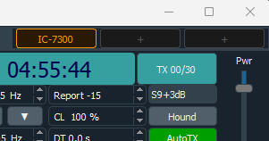

# WKjTX

**Weak-signal HF digital modes for Windows.** WKjTX 1.1 is a freeware
fork of [JTDX](https://sourceforge.net/p/jtdx/), itself forked from
[WSJT-X](https://wsjt.sourceforge.io/wsjtx.html) (K1JT). It speaks
FT8, FT4, JT65, JT9, JT9+JT65, T10 and WSPR-2 — same decoders, same
operating modes as upstream.

## What's new in 1.1

- **3-slot radio profile quick-switch** — three buttons in the top-right
  menubar corner (next to Help). Slot 1 mirrors your base configuration;
  slots 2 and 3 are independent overlays stored in separate INI files
  under `%LOCALAPPDATA%/WKjTX/profiles/`. Left-click to switch radios
  instantly (CAT + audio + transceiver reconnect). Left-click "+" on
  empty slots opens a compact configurator with auto-detected serial
  ports for CAT and PTT. Right-click for Configure / Rename / Hide /
  Clear.

  

  > Profile actions never overwrite the base `WKjTX.ini`. Mistakes in
  > slot 2 or 3 stay in their own file — your main configuration is
  > always safe.

## What's different from JTDX

- **Auto-call** — *File → Auto-call...* opens a dedicated dialog
  with a master switch and 7 trigger categories (Alert callsigns,
  NEW DXCC, NEW CQ zone, NEW ITU zone, NEW grid 4-char, NEW prefix,
  NEW callsign). When a decoded message matches an active category,
  WKjTX **transmits a reply automatically**. Five alert-callsign
  slots for explicit watch lists. Hardcoded safeguards (not
  user-editable): each callsign called at most once every 120 s,
  global cap of 3 auto-calls per minute. A flashing badge in the
  status bar shows when at least one category is ON, so you always
  know if the station is hot.

  

  > **Use responsibly.** With auto-call ON the station transmits
  > unattended. You are responsible for staying within your licence
  > and never leaving an auto-calling station hooked up to a linear
  > or a timer-driven antenna switch.

- **More reliable CQ / QSO responses**: the auto-sequencer no longer
  drops replies in marginal copy and no longer gets stuck in endless
  CQ loops. You answer the station that just answered you, and you
  stop calling CQ when nobody's coming back — the way it should
  always have worked.
- **One-click data refresh**: a single *Update data* button in
  Settings → General fetches `cty.dat`, `state_data.bin`,
  `grid_data.bin` and `lotw-user-activity.csv` from their official
  sources, with editable URL fields so you can point at a mirror.
- **Log import / export in-app**: read a third-party `.adi` file
  into the internal log (dedup on CALL + QSO\_DATE + BAND + MODE);
  export a snapshot without leaving the app.
- **Font size spinboxes** next to the existing *Application Font...*
  and *Decoded Text Font...* buttons — change point size with one
  click.
- **English-only binary**, user-supplied translations: drop your
  compiled `wkjtx_<locale>.qm` into `bin/translations/` and switch
  *Language* in `JTDX.ini`. Legacy `jtdx_<locale>.qm` names are
  accepted as-is. See
  [`bin/translations/README.txt`](bin/translations/README.txt) in
  each release.
- **5 UI themes** selectable from the *Tema* menu: **Amber Classic**
  (default warm dark), **Amber Night** (deeper black), **Amber High
  Contrast**, **Native** (OS default style) and **Dark (legacy JTDX)**.
  The active theme is persisted across sessions.
- **3-slot radio profile quick-switch** *(NEW in 1.1)*: three buttons
  in the menubar corner (next to Help). Slot 1 mirrors your base
  configuration; slots 2 and 3 are independent overlays in
  `%LOCALAPPDATA%/WKjTX/profiles/slot<N>.ini`. Left-click to switch
  rigs (CAT + audio + transceiver reconnect). Empty slots show "+"
  and open the compact configurator with auto-detected COM ports for
  CAT and PTT. Right-click for Configure / Rename / Hide / Clear.
- **Hamlib updater** opens the JTDX SourceForge Hamlib directory in
  your browser — manual drop-in of `libhamlib-5.dll` with an
  automatic `_old` backup slot.
- **Independent versioning.** Currently at **1.1.0**. The upstream
  JTDX 2.2.x version number is no longer exposed.

Planned in later releases: per-profile log routing, qrz.com upload.

## Download

Latest portable build: see the
[**Releases**](https://github.com/iu2vwk-ita/WKjTX/releases) page. Each
release ships a `WKjTX-<version>-portable-win64.zip` with everything
bundled — no installer, no system changes.

## Install from source

See [INSTALL-WKjTX.md](INSTALL-WKjTX.md) for the full MSYS2 MINGW64
build pipeline (Qt5, Hamlib, FFTW, GNU Fortran). Typical build
time on a modern laptop: 10–30 minutes.

## User guide

[USER-GUIDE.md](USER-GUIDE.md) covers first-run configuration,
the *Data updates* section, Import/Export ADIF, the font spinboxes,
and language swapping via `.qm` files.

## Support the project

WKjTX is free and will stay free. If it saves you time or lands you a new DXCC,
consider buying me a beer — it keeps the coffee hot and the commits coming.

## License

GPL-3.0, inherited from WSJT-X and JTDX. Full text in [COPYING](jtdx-source/COPYING).

## Credits

- **WSJT-X** — Joe Taylor K1JT and the WSJT Development Group
  (FT8/FT4/JT65/JT9/WSPR decoder heritage).
- **JTDX** — Igor Chernikov UA3DJY, Arvo Järve ES1JA and the JTDX
  community (HF-focused fork, auto-sequencer, decoder tuning).
- **WKjTX additions** — IU2VWK.

WKjTX is an **independent** fork and is **not endorsed** by the
WSJT-X or JTDX projects. Bug reports for WKjTX-specific code should
be filed here, not upstream.
